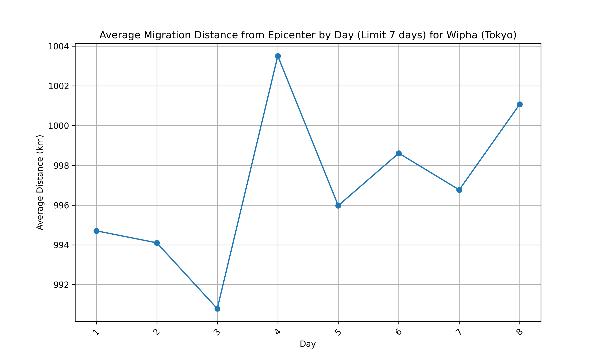
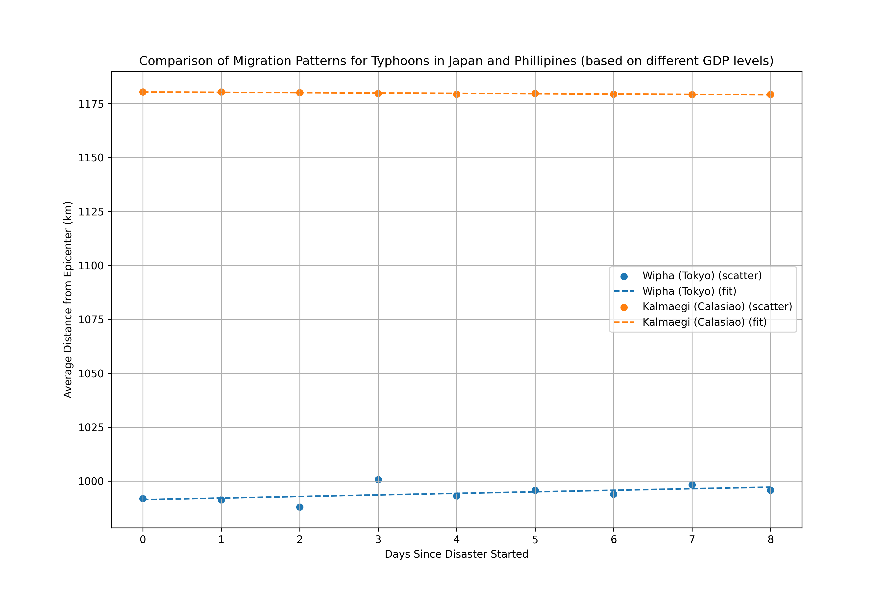
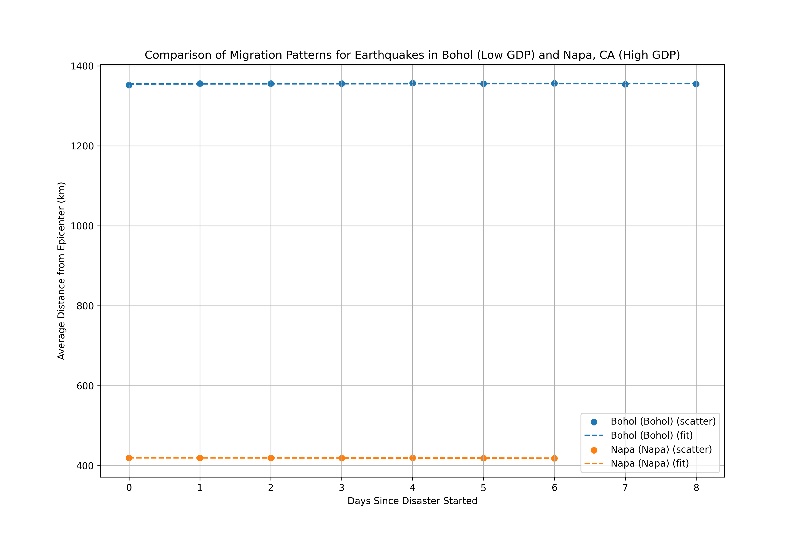
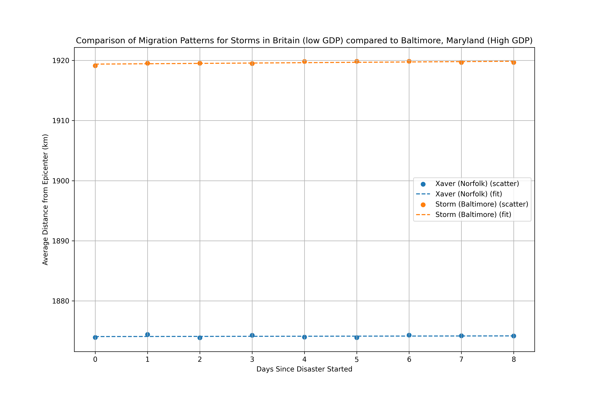
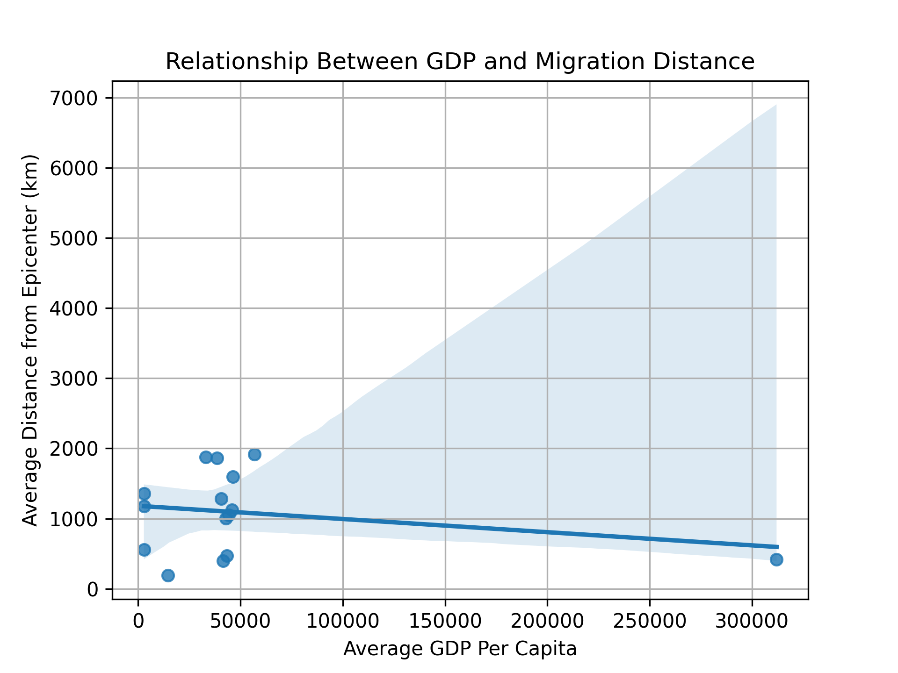

# Geolocating Digital Refugees: Twitter User Behavior During Natural Disaster Events

## Group Members
- Korin Wheaton
- Kayla Musser

## Table of Contents

- [Colab Worksheet Repo Link](#link)
- [Abstract](#abstract)
- [Research_Questions](#rq)
- [Methods_&_Results](#methods)
- [Analysis](#analysis)
- [Results](#results)
- [References_Cited](#ref)
 
# **“Geolocating Digital Refugees: Twitter User Behavior During Disasters”**

## [Colab Worksheet Repo Link](#link)
[Colab Worksheet](https://github.com/korinwhe/disasters_twitter.git)

## [Abstract](#abstract)

This project utilizes a Kaggle dataset containing geolocation data from Twitter during fifteen major natural disasters across five types (typhoons, wildfires, earthquakes, winter storms, and thunderstorms). The dataset includes over 3.6 million geo-tagged tweets from 212,735 users, with information about human movement before, during, and after each event. The objective is to analyze how far users migrate during these events, variations in migration distances and timing across disaster types, and the potential influence of socioeconomic factors like GDP on migration behavior.

This analysis can aid in predicting migration patterns during disasters, helping improve resource allocation and the effectiveness of emergency alert systems. Additionally, mapping socioeconomic variables like GDP per capita provides further insight into disparities in migration behavior.

## [Research_Questions](#rq)

Q1: During disaster events, what is the average distance Twitter users travel away from the epicenter from day one to day 8?

Q2: Can we separate these migration routes among different days?

Q3: Can we compare 3 different disaster events with two different countries with varying GDP per capita and how far in 8 days people are migrating from the epicenter of a disaster?

## [Methods_&_Results](#methods)

Describe in detail the data preparation and any issues or concerns with the data. Describe your analysis. Present tables and/or visualizations. Tables and visualizations should be accompanied by captions as well as by in-text descriptions.

**Cleaning and Preprocessing:**

* Load pandas, os, and geopy.distance plotly.io, scipy, sklearn etc.libraries and modules.  
* Loaded reference dataset and initial datasets for the locations and types of disasters… complete preprocessing and load the new dataframe as a csv file for easier accessibility.  
* Ensured columns for disaster events, latitude, longitude, and timestamps were properly formatted, renamed columns and string values for disaster.events to ensure clarity.  
  * Drop na values (there was only one row that was bad)  
* Converted time data to datetime format and validated numerical latitude and longitude values.  
  * Switch columns latitude and longitude  
* Used the Haversine formula (via Python's geopy library) to calculate migration distances between coordinates of the epicenter and the user.anon locations. Used these distances and took the average per day instead of per timestamp.  
  * We used the Wipha Typhoon in Tokyo, Japan but you can initialize any disaster you want included in the df\_event\_start\_location.unique() set.

**Segmentation:**

* Include user.anon (user anonymous data) data that only starts at the time the disaster starts (or day before to reference the location better)   
* Segmented data into the start of the disaster Day 0 until Day 8, by creating a days\_since\_disaster column based on tweet timestamps 

**Integration of External Data:**

* Merged GDP per capita data (2013-2016) for affected regions to distinguish movement behaviors based on wealth disparities.   
* Looked at the highest GDP per capita vs lowest GDP per capita of specific disaster types 

### [Analysis](##analysis)

Comparative Visualizations:  
Compared average distances on each of the first 8 days of all the users from the epicenter of the Wipha typhoon.
  

Compared to the migration of twitter users' locations over the first four days of the Wipha typhoon.

Day 1

<iframe src="disasters_death/mapbox_plot_day_0.html" width="100%" height="600px" style="border: none;"></iframe>

Day 2

<iframe src="disasters_death/mapbox_plot_day_1.html" width="100%" height="600px" style="border: none;"></iframe>

Day 3

<iframe src="disasters_death/mapbox_plot_day_2.html" width="100%" height="600px" style="border: none;"></iframe>

Day 4

<iframe src="disasters_death/mapbox_plot_day_3.html" width="100%" height="600px" style="border: none;"></iframe>
  
* Comparison of migration patterns for three of the disaster types comparing two countries affected by the disaster, one with a low gdp and the other with a high GDP per capita and found the average distance from the epicenter over 8 days.
    
    
    
  * We can see that in each set of disaster types, there weren't any significant fitted slopes and most of the lines were parallel, showing that over the days, there wasn’t an increase in migration away from the epicenter sites. However, there was a difference in km from the epicenter overall with the different countries, which were compared based on GDP per capita level.   
  * In addition to this, we also did a Pearson’s R test for correlation and calculated the p-values. We got a correlation coefficient of \-0.24 for the correlation of GDP per Capita (USD) against the average distance traveled. We can see that the correlation coefficient shows a weak negative correlation between GDP per Capita (USD) and distance from the disaster epicenter. However, our p-value of the correlation coefficient gives us 0.38661471513906603, which against a significance level of 0.95, shows that our correlation coefficient could be showing an association where there may not be an association due to sampling errors.
  * Here is a graph that shows the slight negative correlation. Take this visual with a grain of salt!
    

## [Results](#results)

**Q1**: The analysis revealed that, on average, Twitter users experiencing the Wipha typhoon in Tokyo traveled approximately 14 kilometers more away from the epicenter between Day 3 and Day 4 from the start of the typhoon. This distance represents the typical movement of users as they responded to the unfolding disaster, although it is important to note that this average figure may mask a wide range of individual behaviors. Some users may have migrated much further from the epicenter, while others remained in relatively close proximity. This average migration distance provides a useful metric for understanding the general movement trends during the early stages of the disaster, but further investigation could uncover variations in migration behavior based on factors such as socioeconomic status, geographic location, or the severity of the disaster. This finding also serves as a baseline for comparing migration patterns across typhoons in a similar geologic and demographic area, helping to assess the consistency of user behavior in wind-variant disaster scenarios. Since we chose just Wipha (Tokyo), we can’t generalize the sample population to other population types and disasters, since Tokyo has a relatively high GDP and is geographically isolated. 

**Q2**: Our analysis also allowed us to distinguish migration routes over multiple days, providing a clearer picture of how Twitter users' locations evolved throughout the disaster. By segmenting the data into distinct time periods (Day 1-4 since the disaster started), we were able to create a detailed Mapbox visualization of the migration patterns. The visualization revealed that while the concentration of data points on the map showed minimal changes between consecutive days, the overall number of data points increased noticeably from Day 1 to Day 4\. This suggests that more users were actively tweeting and potentially relocating as the disaster progressed, even though the spatial distribution of these tweets remained relatively consistent. This observation may indicate that users were not moving in large clusters but rather in a more dispersed manner, with some choosing to stay near the epicenter while others migrated to surrounding areas. Further exploration could focus on understanding the factors influencing these migration choices and whether they align with government evacuation orders, the availability of resources, or other external influences.

**Q3:** Through our analysis, we uncovered distinct migration patterns across regions with varying GDP levels during isolated types of disasters, providing valuable insights into differences in mobility. By comparing migration distances across low-GDP regions (e.g., Bohol, Norfolk, and Calasiao) and high-GDP regions (e.g., Napa, Baltimore, and Tokyo), we identified a possible trend where individuals in low-GDP areas migrated farther from disaster epicenters specifically in the typhoon and earthquakes scenarios. For instance, post-earthquake migration in Bohol averaged 1,400 km compared to Napa’s 400 km, and typhoons in Calasiao prompted migrations averaging 1,175 km, exceeding Tokyo’s 1,000 km. For the winter storm/thunderstorm scenarios, there wasn’t a huge difference in GDP per Capitas in Norfolk vs. Baltimore (difference by less than $10,000). The storm comparison actually showed that in Baltimore, individuals on average were further away from the storm than in Norfolk, Britain (lower GDP per capita). These findings suggest that resource constraints and recovery options may drive people in low-GDP regions to seek refuge farther away, while individuals in high-GDP regions tend to exhibit more localized mobility. Using summary statistics to verify the influence of GDP on average migration distance, we used Pearson’s R correlation coefficient, which gave us a coefficient of \-0.24 and a corresponding p value of 0.3866147151390660. This p value against a significance level of 0.95, shows that our correlation coefficient could be showing an association where there may not be an association due to sampling errors. Basically, even though our findings from the visualizations show a difference in distance away from the epicenter locations, summary statistics may indicate sampling error or mishandling of data collection. Further exploration could examine how factors such as infrastructure, government response, and access to resources influence these migration behaviors.

**Limitations:**  
Our study included several factors that may have affected the accuracy and generalizability of the findings. First, the dataset is based on Twitter users, who may not fully represent the general population, especially in areas with limited internet access or lower social media penetration. Twitter user data (time of tweets) may not be the best proxy for analyzing migration data. Second, Twitter user data was anonymized and the latitude and longitude must have been modified to further anonymize the individual users. The latitude and longitude values were flipped, as we realized after trying to calculate the great circle's distance (we switched it back). Third, as data scientists, we actually didn’t collect the data from Kaggle. This data was raw and there might have been mishandling of values in the data. The merging of the disaster epicenter dataset was also up to our interpretation and general research, and looking for accurate information on the landfall location of typhoons ten years ago was almost inaccessible.   
Additionally, the geolocation of tweets may not always be precise due to factors like device type or GPS signal strength. External factors, such as government evacuation orders or local infrastructure conditions, may have influenced migration behavior but were not accounted for in the analysis. Furthermore, the GDP data used in the study, sourced from 2013-2016, may not accurately reflect current conditions or regional variations in wealth and development. These limitations should be considered when interpreting the results and suggest avenues for further refinement in future research.

**Further Study:**

In the future, we could explore additional disaster types to better understand migration patterns across various scenarios. Expanding the temporal scope to include a longer period, which may reveal long-term trends in migration and recovery. Investigating the influence of socioeconomic factors, including income, education, and urban vs. rural living, on migration behavior could provide deeper insights, while real-time socioeconomic data would enhance accuracy. Analyzing Twitter user demographics (age, gender, etc.) and comparing migration patterns across different social media platforms could offer a more holistic view. Additionally, examining the impact of government disaster response on migration routes and behavior could inform disaster management strategies.

## [References_Cited](#ref)

Kettle, Anthony James. “Storm Xaver over Europe in December 2013: Overview of Energy Impacts and North Sea Events.” Advances in Geosciences, vol. 54, pp. 137–47, doi:https://doi.org/10.5194/adgeo-54-137-2020. Accessed 7 Dec. 2024\.  
Holstege, Sean. “Flashback: Historic Phoenix Storm of Sept. 8, 2014.” The Arizona Republic, 7 Sept. 2015, [https://www.azcentral.com/story/news/local/phoenix/2015/09/06/historic-storm-phoenix-2014-flashback/31563463/](https://www.azcentral.com/story/news/local/phoenix/2015/09/06/historic-storm-phoenix-2014-flashback/31563463/).  
August 11, 2014 Historic Rainfall. https://www.weather.gov/dtx/081114\_flooding. Accessed 7 Dec. 2024\.  
Repository, Dryad Digital. “Human Mobility During Natural Disasters.” Kaggle, https://www.kaggle.com/datasets/dryad/human-mobility-during-natural-disasters/data. Accessed 7 Dec. 2024\.
